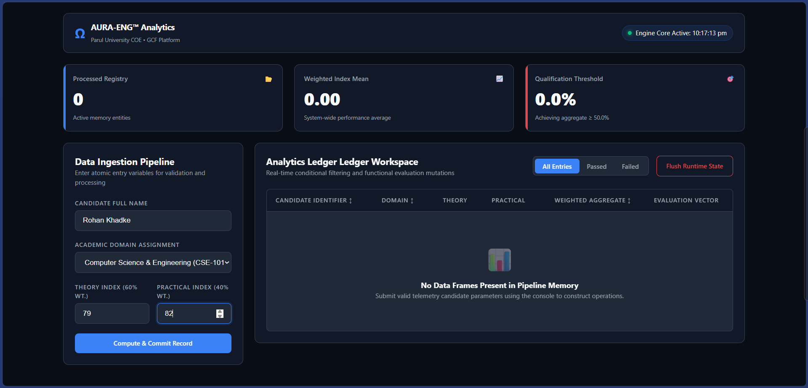
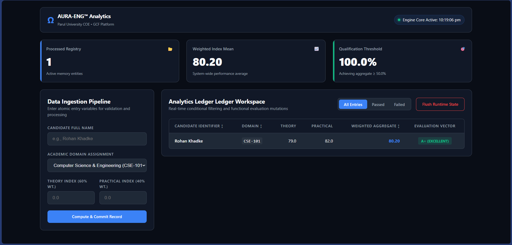

# Enterprise Analytics Console | GCF JavaScript Capstone

An advanced, vanilla JavaScript student performance assessment and telemetry engine. This platform provides real-time algorithmic grading evaluation, data validation, asynchronous processing modeling, and multi-dimensional sorting matrices without reliance on external libraries or frameworks.

Developed in compliance with the **Parul University COE - Global Certification Forum (GCF)** curriculum standards (Domains 1.0 through 5.0).

---

## 🚀 Live Deployment
The application is hosted and publicly accessible via GitHub Pages:
🔗 **[Live Application Link](https://YOUR_GITHUB_USERNAME.github.io/YOUR_REPO_NAME/)**

---

## 📸 Application Interface & Telemetry

### 1. Main Dashboard Overview
*Real-time data ingestion control pipeline coupled with systemic telemetry summarization boxes processing total memory entities, class averages, and qualification boundaries.*

<p align="center">
  
</p>

### 2. Ingestion Validation & Asynchronous Operations
*Demonstrating data validation pipelines catching illegal entries and simulating processing delays via native Promise structures.*

<p align="center">
  
</p>

### 3. Functional Array Mutations (Filtering & Sorting)
*Live demonstration of complex data frame sorting and filtering across dynamic matrix attributes using low-overhead document fragments.*

<p align="center">
  
</p>

---

## 🛠️ Technical Domain Implementations (GCF Syllabus Syllabus Coverage)

* **Domain 1.0: Operators, Methods, and Keywords**
    * Implements structural exception management using `try...catch...finally` blocks to intercept runtime processing anomalies.
    * Uses compound assignment and strict equality logic handling throughout data structures.
* **Domain 2.0: Variables, Data Types, and Functions**
    * Applies primitive data validation workflows via `isNaN()` checking models.
    * Utilizes encapsulated state objects and mutable single-dimensional arrays to record historical evaluation streams.
* **Domain 3.0: Decisions and Loops**
    * Applies conditional decision matrices using logical operations (`&&`, `||`) combined with switch-case structures to evaluate performance levels.
    * Processes class metrics calculation tracking using functional array processing parameters and loops.
* **Domain 4.0: Document Object Model (DOM)**
    * Mitigates layout engine painting overhead through dynamic native memory-allocated `DocumentFragment` generation.
    * Utilizes targeted DOM tree manipulation parameters (`appendChild`, `setAttribute`, `innerHTML`) to refresh application views.
* **Domain 5.0: HTML Forms**
    * Intercepts HTTP request transport workflows via `preventDefault()` hooks within programmatic `onsubmit` listeners.

---

## 📂 File Architecture

```placeholders
├── index.html       # Structural interface definition component
├── style.css        # Enterprise canvas design stylesheet rules
├── app.js           # Core event-driven functional state mutator
└── screenshots/     # Storage folder for system interface images
    ├── dashboard_overview.png
    ├── validation_handling.png
    └── filtering_sorting.png